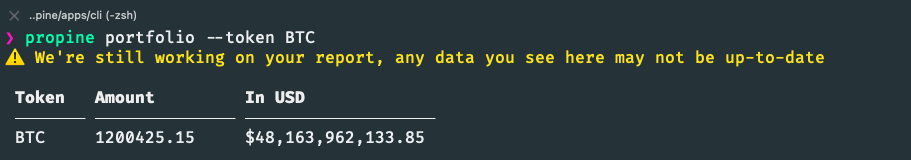
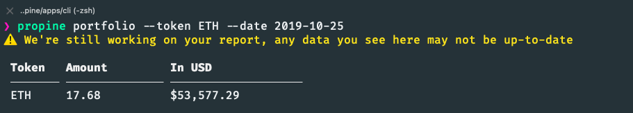

### Table of contents

TBU

### Prerequisites

- [Node.js](https://nodejs.org/en/download): JavaScript runtime
  
  > Recommended version `14.x LTS`

- [Yarn](https://yarnpkg.com): Dependency management tool

  Yarn is required for its speed & [`workspace`](https://yarnpkg.com/lang/en/docs/workspaces) feature
  
  > Recommended version `>= 1.22.0`

- [Docker](https://www.docker.com): Containerization

  > Recommended version `Latest`

### Getting started

1. Clone this project
  
   ```sh
   git clone git@github.com:phamtri2395/propine.git
   ```

2. Start local ecosystem (TimescaleDB, Localstack)

   ```sh
   yarn ecosystem:local up -d # for the first time
   ```

3. Install dependencies & build packages

   ```sh
   yarn && yarn build
   ```

4. Install `CLI` application globally

   ```sh
   (cd apps/cli && npm link)
   ```

5. Start all services

   ```sh
   yarn start
   ```

### How to use the CLI

- Firstly, let use the CLI to upload the transaction file to S3, ex:

  ```sh
  propine upload ~/Desktop/transactions.csv
  ```

  

- When we've done with file upload, we can use `propine portfolio` to look up for latest portfolio of all tokens

  ```sh
  propine portfolio
  ```

  

- To get latest portfolio of a token

  ```sh
  propine portfolio --token BTC
  ```

  

- To get portfolio of all tokens in a specific date

  ```sh
  propine portfolio --date 2019-10-25
  ```

  

- To get portfolio of a token in a specific date

  ```sh
  propine portfolio --token ETH --date 2019-10-25
  ```

  

### Architecture

<br/>
<div align="center">
  
</div>
<br/>

1. Collect report

  Transaction report (CSV file) is uploaded to `AWS S3` by CLI for later ingestion

2. Report ingestion

  - An `AWS Lambda` - Report ingestion function is then invoked, which will create a stream to S3 bucket and iterate line-by-line of the CSV
  - The function will do the data transformation and persist results into `TimescaleDB`
  - This ingestion process is an expensive task, which usually take up to `35 minutes` on my machine

3. Persist transactions
  
  - TimescaleDB - which is an extension of PostgreSQL, is used as time-series persistent storage
  - A hypertable is then created over the standard PostgreSQL's table
  - The reading performance of TimescaleDB is great, it took only `~30ms` to query a table of `30 million` records
   
4. Query

  There's a Portfolio service, which will be in charge of providing `Graphql` interface to clients

6. Price conversion

  CryptoCompare is used for price conversion

### Rooms for improvement

- The report ingestion function (AWS Lambda) should only be invoked by schedule - several times a day to reduce cost
- 
